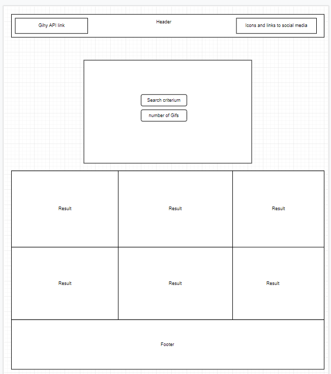
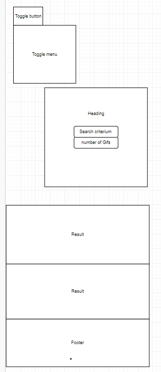
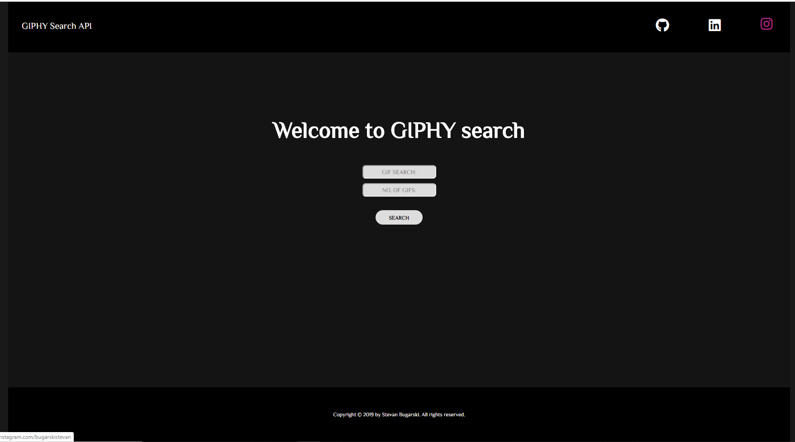
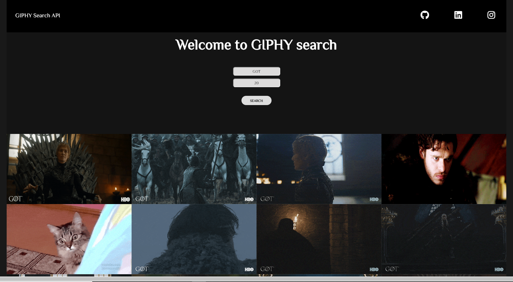
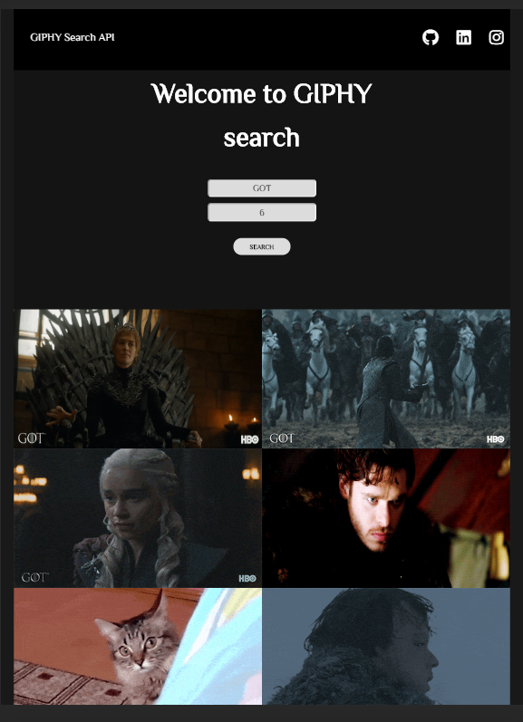
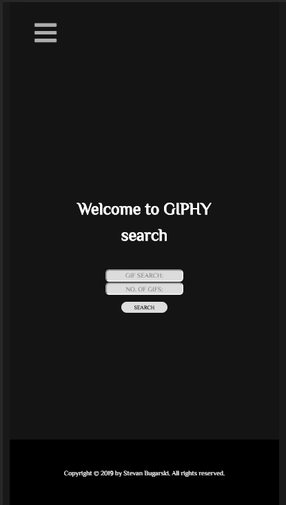
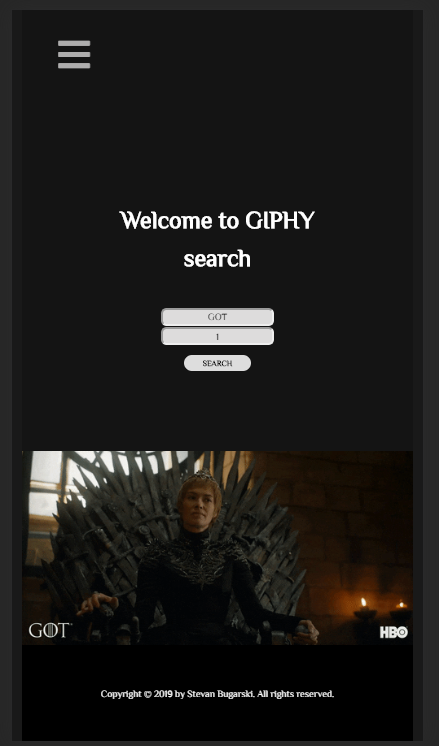

<h1>Website With a Search Engine</h1>

<b>Name: Stevan Bugarski</b>

<b>Email: bugarski.stevan@gmail.com</b>

<b>Organization: Wagner college</b>

<b>Program: Full Stack Web Development Bootcamp</b>

<b>Project: Website With a Search Engine</b>

<h2>Project overview:</h2>

 The goal of this project is to build a website with a search engine. Where according to the users inputs for search criterium and number of results. The gifs will be get from GIPHY APY site and displayed on the web page.

<ol><h2>Instalation:</h2>
	<li>In your terminal find the project folder and write <em>npm install</em>.</li>
	<li>After that write <em>npm install webpack webpack-cli</em>.</li>
	<li>After that write <em>npm run start</em> will lunch the website locally.</li>
	</ol>

<h2>Requirements:</h2>
<ol><h3>User Stories:<h3>
	<li><em>As an android phone user I want to web site be accessible from diferent devices so that I can use it from my selphone.</em></li>
	<li><em>As a gif user I want to get gifs according to search criterium so that I can post them on social media.</em></li>
	<h2>Wiraframes:</h2>
	<h3>Desktop view:</h3>
	
	<h3>Mobile view:</h3>
	
	</ol>
	
	
<ol><h2>Development process: </h2>
	<li>Created GitHub repository Giphy-Search-Engine.</li>
	<li>Installed npm packages for this project</li>
	<li>Got the API key from Giphy developers website.</li>
	<li>Wrote the HTML and JavaScript code.</li>
	<li>Imported font style from font awesome website</li>
	<li>Added style to the code using Sass.</li>
	<li>Created responsive site using @media queries and Flexbox.</li>
	<li>Tested the responsives of code for diferent sizes devices using developer tools in console.</li>
	<li>Pushed the commits through the developing process randomly to  GitHub.</li>
	</ol>
<ol><h3>Tehnologies used for this project</h3>
	<li>HTML,</li>
	<li>CSS, Sass, Flexbox,</li>
	<li>Git,</li>
	<li>Npm,</li>
	<li>JavaScript, Jquery.</li>
	</ol>
<h3>Results:</h3>
<h4>Desktop view no results:</h4>

<h4>Desktop view with results:</h4>

<h4>Tablet view:</h4>

<h4>Mobile view no results:</h4>

<h4>Mobile view:</h4>

<h3>Future improvements:</h3>

 In the future my plan is to implement Flexbox grid system for easier aligning and sizing objects on the web page and easier maintaining the web site.

